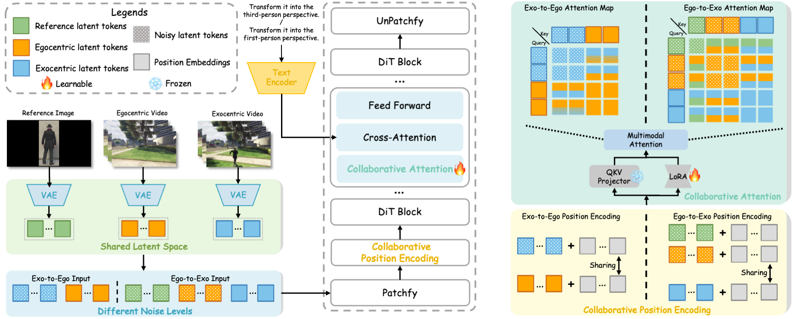

<div align="center">
<h1>
WorldWander: Bridging Egocentric and Exocentric Worlds in Video Generation
</h1>


</div>


## 🎬 Demo
<b>TL;DR:</b> We propose WorldWander, an in-context learning framework tailored for translating between egocentric and exocentric worlds in video generation. We also release <b>[EgoExo-8K](XXX)</b>, a large-scale dataset containing synchronized egocentric–exocentric triplets. The demo is shown below:


#### Exocentric-to-Egocentric
| ExoVideo  |  |  |  |
| ------ | ------------------------------------------------- | ------------------------------------------------- | ------------------------------------------------- |
| **Output** |  |  |  |


#### Egocentric-to-Exocentric
| **RefImage**  |  |  |  |
| ------ | ------------------------------------------------- | ------------------------------------------------- | ------------------------------------------------- |
| **EgoVideo**  |  |  |  |
| **Output** |  |  |  |


## 📖 Overview
Video diffusion models have recently achieved remarkable progress in realism and controllability. However, achieving seamless video translation across different perspectives, such as first-person (egocentric) and third-person (exocentric), remains underexplored. Bridging these perspectives is crucial for filmmaking, embodied AI, and world models.
Motivated by this, we present <b>WorldWander</b>, an in-context learning framework tailored for translating between egocentric and exocentric worlds in video generation. Building upon advanced video diffusion transformers, WorldWander integrates (i) <i>In-Context Perspective Alignment</i> and (ii) <i>Collaborative Position Encoding</i> to efficiently model cross-view synchronization.
Overall framework is shown below:


## 🤗 Datasets
To further support our task, we curate <b>[EgoExo-8K](XXX)</b>, a large-scale dataset containing synchronized egocentric–exocentric triplets from both <i>synthetic</i> and <i>real-world</i> scenarios.
We show some examples below:


## 🔧 Environment
```
git clone https://github.com/showlab/WorldWander.git
# Installation with the requirement.txt
conda create -n WorldWander python=3.10
conda activate WorldWander
pip install -r requirements.txt
# Installation with environment.yml
conda env create -f environment.yml
conda activate WorldWander
```


## 🚀 Try Inference
WorldWander is trained on the [wan2.2-TI2V-5B](https://huggingface.co/Wan-AI/Wan2.2-TI2V-5B-Diffusers) model using 4 H200 GPUs, with a batch size of 4 per GPU.
To make it easier for you to use directly, we provide the following checkpoints for different tasks:

| Models                             | Links               | config                             |
| ---------------------------------- | ------------------- | ---------------------------------- |
| wan2.2-TI2V-5B_three2one_synthetic | 🤗 [Huggingface](xxx) | configs/wan2-2_lora_three2one_synthetic.yaml |
| wan2.2-TI2V-5B_one2three_synthetic | 🤗 [Huggingface](xxx) | configs/wan2-2_lora_one2three_synthetic.yaml |
| wan2.2-TI2V-5B_three2one_realworld | 🤗 [Huggingface](xxx) | configs/wan2-2_lora_three2one_realworld.yaml |
| wan2.2-TI2V-5B_one2three_realworld | 🤗 [Huggingface](xxx) | configs/wan2-2_lora_one2three_realworld.yaml |

You can download the specific checkpoint above and specify the corresponding config file for inference.
For convenience, we have provided the following example script:
```
bash scripts/inference_wan2.sh
```
Note that the parameter `ckpt_path` needs to be updated to the path of the checkpoint you downloaded.
<b>It is recommended to run this on a GPU with 80GB of VRAM to avoid out of memory.</b>


## 🔥 Custom Training
You can also train on your custom dataset. To achieve this, you first need to adjust the `first_video_root`, `third_video_root`, `ref_image_root`, and other parameters in corresponding `config` file. If necessary, you may need to modify the `CustomTrainDataset` class in `dataset/custom_dataset.py` according to the attributes of your own dataset.
For convenience, we have also provided the following training script:
```
bash scripts/train_wan2.sh
```


## 🎓 Bibtex
👋 If you find this code helpful for your research, please cite:
```
XXX
```
